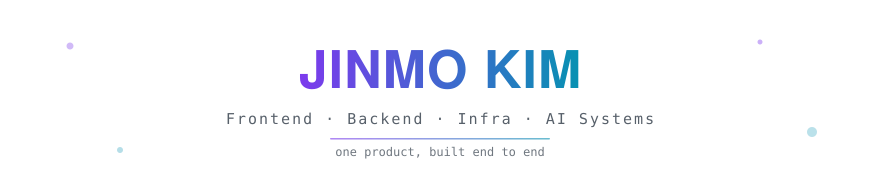

<picture>
  <source media="(prefers-color-scheme: dark)" srcset="./assets/banner-dark.svg">
  
</picture>

[한국어](./README.md) · [日本語](./README.ja.md) · **English**

## About

- Full-stack engineer who **builds one product end to end**, frontend to backend to infra
- Building AI systems that run in the real world with **[WIGTN](https://github.com/wigtn)**, a five-person AI dev and research crew
- Co-author of **[WIGVO](https://github.com/wigtn/wigvo)**, real-time interpretation over ordinary phone calls, accepted to **[ACL 2026 System Demonstrations](https://openreview.net/forum?id=9oUknRxASv)** · 555ms median latency, 0 echo loops in 147 calls
- Runner-up, **Snowflake AI & Data Hackathon Korea 2026**

## Featured

### [wigvo](https://github.com/wigtn/wigvo)

Real-time Korean-English interpretation over ordinary phone calls · no app needed on the far side · 555ms median latency · 0 echo loops in 147 calls

### [portfolio](https://github.com/moriroKim/portfolio)

Case studies recording problem definitions, rejected alternatives, and missteps
## Stack

  

## GitHub

<picture>
  <source media="(prefers-color-scheme: dark)" srcset="https://raw.githubusercontent.com/moriroKim/moriroKim/output/github-snake-dark.svg">
  
</picture>

## Links

